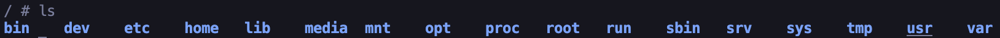

# isolate_sys

## Introduction

Hello there,

In this project, I have decided to learn the fascinating process of isolation, similar to what occurs in Docker. My journey started with namespaces, beginning with the Unix Time Sharing (UTS) namespace and ending with the Network namespace. It was an amazing experience because this project enabled me to isolate my system significantly, much like in Docker.

## Using

If you would like to test this program, follow the steps below (but first, ensure that you have the make utility and C-compiler gcc installed):

1. Clone this repository
2. Run this command `make`

Now you see this picture

Let's try to explore this place and run `ls` command

You will see the root system file, which is an isolated Alpine OS similar to Docker!

Let me be honest i'm really exiceted about it!

To exit, simply run the `exit` command in your terminal.

That's it!

Thank you for your attention, Reader.
