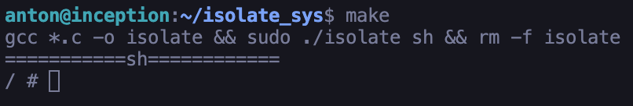

# isolate_sys

## Introduction

Hello, Reader.

In this project i've decided to learn the super intersting process of isolation like it's happening in Docker.

My jorney has been started from namespaces and the first one was UTS (Unix Time Sharing) namespace and ended by Network namespace. It was an amazing experience because with this project we're able to isolate our system hugelly like in Docker so yeah!, it was great.

## Using

If you would like to test this programm just do the steps below ( before this just make sure that you have `make` and C-compiler `gcc`):

1. Clone this repository
2. Run this command `make`

Now you see this picture

Let's try to explore this place and run `ls` command

You see the file root system and it is Alpine isolate OS like in Docker!

Let me be honest i'm really exiceted about it!

If you would like to close just run `exit` command in your terminal.

That's it!

Thank you, Reader, for your attention.
